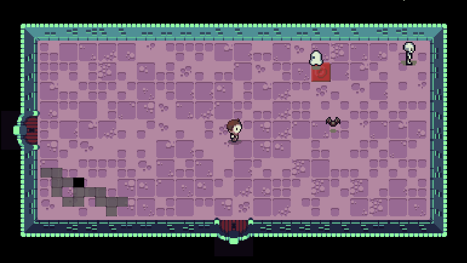

# Legend of Unity
2D Top-down roguelike *demo* made with **Unity**, featuring procedural dungeon generation.

  

<!-- -->

<!-- *The game is still under development!* -->

## What is it all about?

In this project I will be remaking a game using Unity. The game was part of a [course leason](https://cs50.harvard.edu/games/2018/lectures/5/) I did back in 2019 at HarvardX.
The game was originally developed with **Love2D Engine**, using Lua as a programming language.

The original game featured **infinity dungeon generation** that's a room with four doorways generated on the fly infinitely - with no ending and no current dungeon levels, only rooms being created as the players crosses each doorway.

The main goal for this project is to actually implement a proper procedural dungeon generation.

## Some major topics that will be covered are:
* Top-Down Perspective
* Procedural Dungeon Generation (based on Binding of Isaac's Level Generation)
* Hitboxes/Hurtboxes
* Finite State Machine pattern
* Screen Scrolling
* Data-Driven Design (Using Scriptable Objects)

## Goals

As mentioned before, the main goal is to make a proper game based on the prototype, and continue learning and improving my skills as a programmer and Unity developer. The second one, but not the least, is to achive the first goal, **using the best aproches, technics, tools and design patterns possible**

## Development release

Play it on WebGL [here](https://simmer.io/@locovuit_dev/~0c14dbbb-77da-67fa-ecaa-b7a0a19286a9)
The last available version is v0.4.1*

*\*The version available to play may not be the last one*
